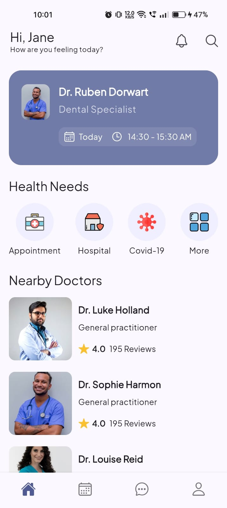
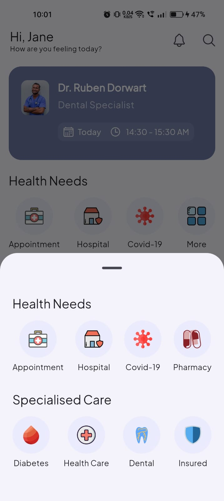

# 🩺 Healthcare App UI

## 📱 Preview  
Take a sneak peek at a modern and intuitive healthcare app UI! This app is designed with Flutter and showcases two beautifully crafted screens.  

| **Screen 1: Dashboard** | **Screen 2: Patient Details** |
|--------------------------|------------------------------|
|  |  |

---

## ✨ Features  
- **Clean & Modern Design:** Sleek UI optimized for a seamless user experience.  
- **Healthcare Dashboard:** Overview of health metrics and appointments.  
- **Patient Details Screen:** Displays comprehensive patient information.  
- **Responsive Layout:** Looks great on all devices.  

---

## 🔧 Tech Stack  
- **Framework:** [Flutter](https://flutter.dev/)  
- **State Management:** Provider  
- **Design:** Custom Widgets & Material Design  

---

## 🚀 Installation  
1. Clone the repository:  
   ```bash
   git clone https://github.com/your-username/healthcare-app-ui.git
